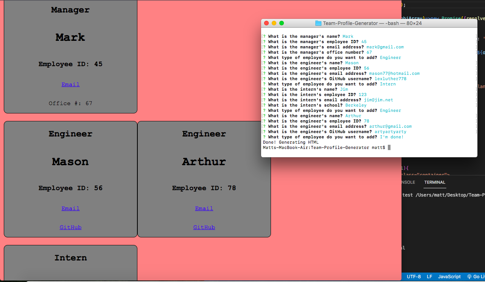
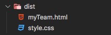
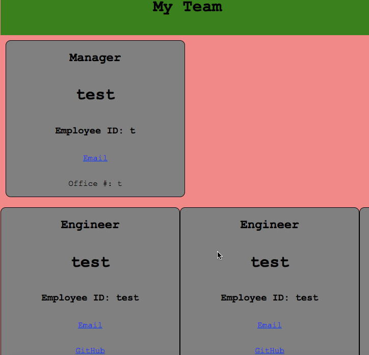

# Team Profile Generator

[](https://opensource.org/licenses/MIT)

This is an application which will prompt the user through terminal regarding the employees on their team. Then, when they are finished, an HTML page will be generated with cards containing the information they entered, all separated into their own corresponding sections based on the roles of the employees specified.



## Getting Started

In order to get started, download/clone the repository's contents do your computer, then navigate to the root directory ("Team-Profile-Generator").

## Prerequisites

You will need Node.js in order to run this application: Download it [here](https://nodejs.org/en/).

## Using the Application

In order to begin the application, run this command in terminal within the root directory:

```
npm start
```

After you've finished, navigate to the "dist" folder in order to access your new HTML file.



## Built With

* [NodeJS](https://nodejs.org/en/)
* [Jest](https://jestjs.io/docs/)

## Features

- Entering only Interns information or only Engineers information will not throw an error
- Users can enter an unlimited amount of Interns or Engineers, and the HTML page will still generate well, as "overflow-x: scroll;" is being utilized in the style.css file


## Author

**Matt Stephens** 

- [Link to Portfolio Site](https://mstephen19.github.io/newestPortfolio)
- [Link to Github](https://github.com/mstephen19)
- [Link to LinkedIn](https://www.linkedin.com/mstephen19)

## License

This project is licensed under the MIT License

## Acknowledgments

* Shoutout to [May Faucher](https://www.linkedin.com/in/mayfaucher/) for being a great study buddy!

## Tests

In order to run the tests for this application, you will first need to install the "Jest" dependency. In terminal within the root directory of "Team-Profile-Generator," run this command:
```
npm i jest
```

Initialize all test suites with this command:
```
npm test
```